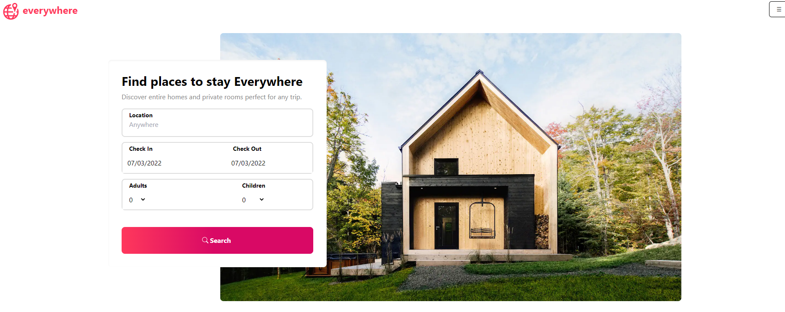
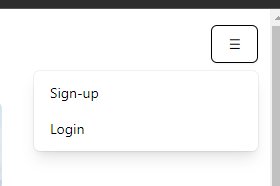
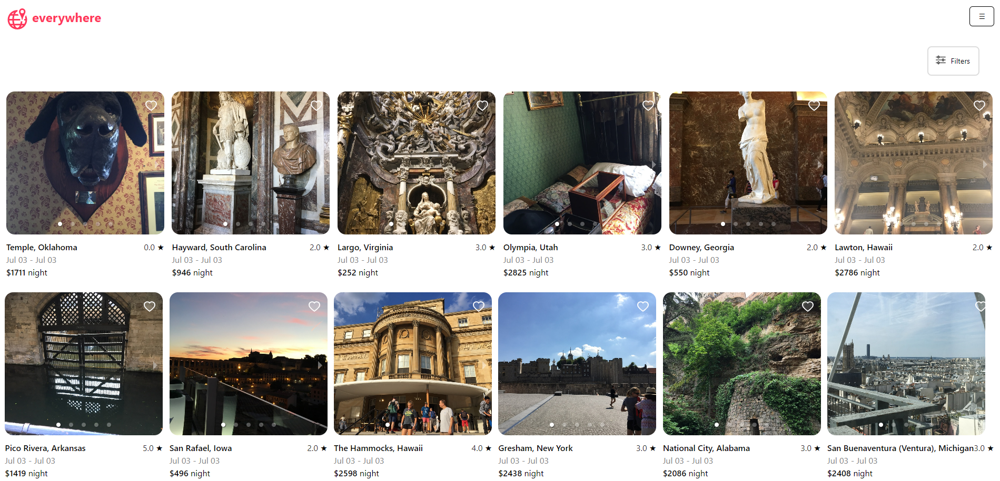
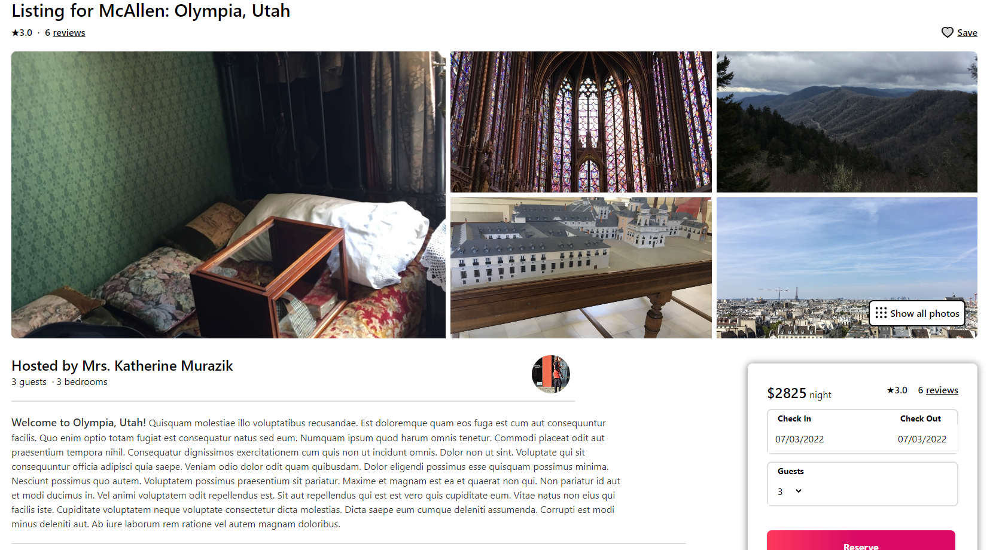
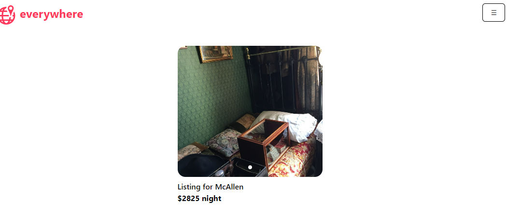
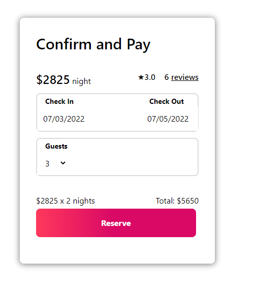
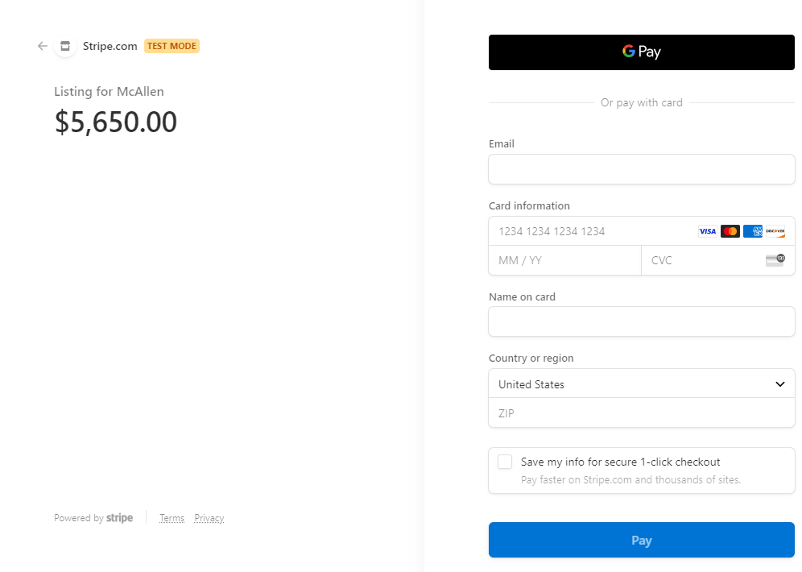
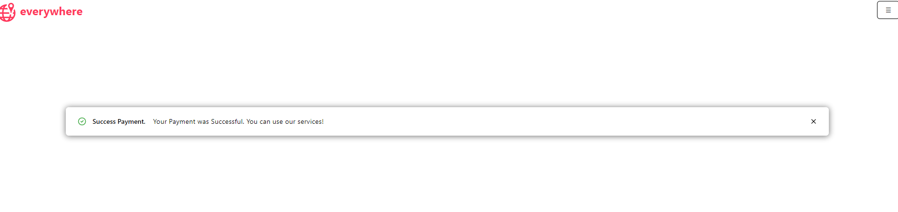
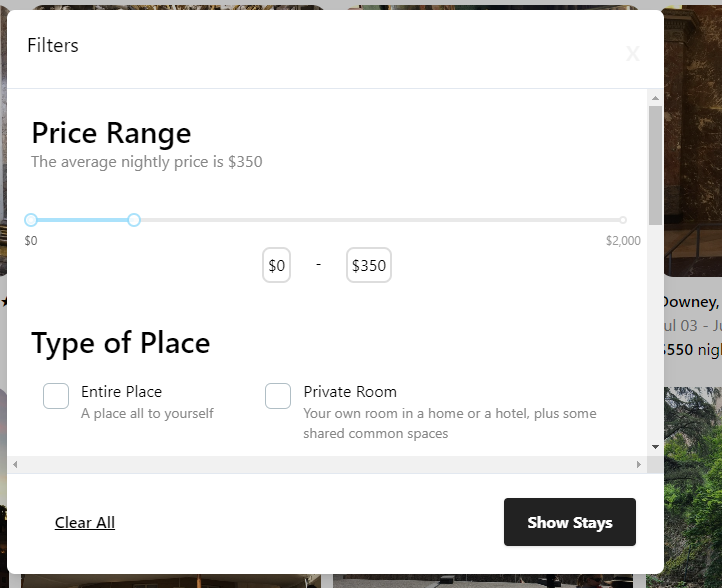

# Everywhere

## Table of Contents

- [Description](#description)
- [Contributors](#contributors)
- [Features](#features)
- [Installation](#installation)
- [Usage](#usage)
- [Contact Information](#contact)
- [License](#license)

## Deployed Website

https://stark-harbor-20365.herokuapp.com/

## API Server

https://immense-hamlet-26327.herokuapp.com
## Description

Everywhere is an AirBNB clone built from scratch for a project in the UofU bootcamp for Web development. The layout and functionality is meant to mimic as closely as possible the AirBNB.com experience. Nothing was taken from AirBNB besides the inspiration for the presentation so everything is built from the ground up from our team.

 When you first enter into the webpage you will be greeted by our friendly homepage where you can specify a location and duration as well as the number of occupants you'd like to have with your stay.

In the top corner you will see a hamburger menu icon that will allow you to login or signup if you have not before

After doing so you can search without entering anything into the location view and it will allow you to see the many listings we have populated on the site. All listings are just temporary data and can easily be adjusted to fit whichever API you decide to use.

When you find a booking you like you can select it and be taken to the information page about the booking.

Also if you like the listing but don't have the opportunity to check out at this moment you can save it to favorites to view at a later time.

 After you push reserve you will be taken to a reservation page where you can confirm all the information about your stay.

After clicking reserve you will be taken to the stripe checkout page where you can enter in your information and pay for your booking.

Upon successful payment you will be taken back to the website where you will recieve a confirmation of successfull payment.

Should you also want to see listings that fit within a certain budget or have specific details with them you can use the filter modal on the bookings page to narrow down your search.

Thank you very much for reviewing our application. 

## Contributors

- David Samuelson

- Emily Pape

- Holdan McMullen

- Eric Shumway

- Juliana Wilcox

## Features

- Uses React and is completely an SPA

- Uses Redux global state management

- Uses Apollo server and graphql API for data retrieval.

## Installation

- Copy the repo to a local repository

- run npm install in the base directory outside of the client and server files.

- You may need to adjust the api calls if you don't want to use the deployed test server we made for the project

## Usage

- After running npm install then run npm run develop and that will start both the backend server and the client side page.

- this is deployed so if you'd like just use the deployed site 

## Contact

linksn.1fan@gmail.com

GitHub: https://github.com/dsamuelson?tab=repositories

## License

Link: https://choosealicense.com/licenses/unlicense/

License Terms:
This is free and unencumbered software released into the public domain.

Anyone is free to copy, modify, publish, use, compile, sell, or
distribute this software, either in source code form or as a compiled
binary, for any purpose, commercial or non-commercial, and by any
means.

In jurisdictions that recognize copyright laws, the author or authors
of this software dedicate any and all copyright interest in the
software to the public domain. We make this dedication for the benefit
of the public at large and to the detriment of our heirs and
successors. We intend this dedication to be an overt act of
relinquishment in perpetuity of all present and future rights to this
software under copyright law.

THE SOFTWARE IS PROVIDED "AS IS", WITHOUT WARRANTY OF ANY KIND,
EXPRESS OR IMPLIED, INCLUDING BUT NOT LIMITED TO THE WARRANTIES OF
MERCHANTABILITY, FITNESS FOR A PARTICULAR PURPOSE AND NONINFRINGEMENT.
IN NO EVENT SHALL THE AUTHORS BE LIABLE FOR ANY CLAIM, DAMAGES OR
OTHER LIABILITY, WHETHER IN AN ACTION OF CONTRACT, TORT OR OTHERWISE,
ARISING FROM, OUT OF OR IN CONNECTION WITH THE SOFTWARE OR THE USE OR
OTHER DEALINGS IN THE SOFTWARE.

For more information, please refer to <https://unlicense.org>
    
